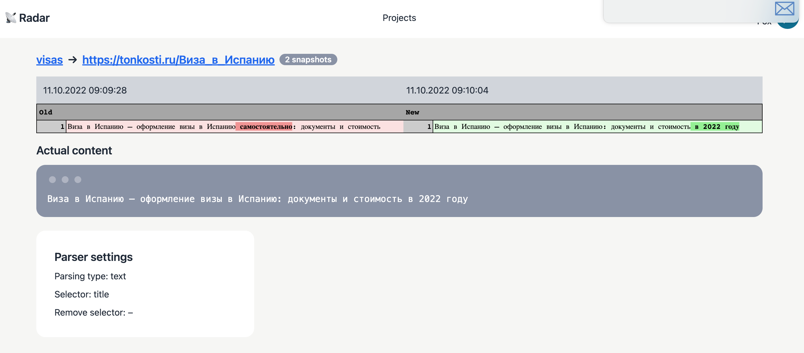

# Radar – отслеживает изменения на страницах
Radar поможет автоматизировать нахождение актуальной информации и следить за страницами конкурентов.



## Возможности
- Регистрация, авторизация
- Добавление страниц для парсинга
- Фильтр контента по css селектору, чтобы не брать лишнее со страницы
- Создание проектов для группировки разных типов отслеживаемых страниц
- Парсинг страниц происходит в фоне, через очереди

## Установка
```
composer create-project yourkey/radar
```
Установить зависимости
```
composer update
```

Переименуйте .env.example в .env и укажите настройки для соединения с базой данных а также APP_URL (host:port)

Запустить миграции
```
php artisan migrate
```
Для заполнения тестовыми данными: ```php artisan migrate --seed``` (у всех пользователей пароль по умолчанию password)

Запустить локальный сервер:
```
php artisan serve
```
Запустить слушатель очередей:
```
php artisan queue:listen
```

### Roadmap
- Автоматический запуск парсинга по расписанию
- Подключение альтернативного парсера (Selenium)

## Uses
- Laravel 8
- Auth: Laravel Fortify, Laravel Sanctum
- Frontend: Tailwind, DaisyUI, VueJS 3

## Tests
Перед запуском тестов укажите данные для тестовой базы данных в файле .env или phpunit.xml.
```
php artisan test
```
